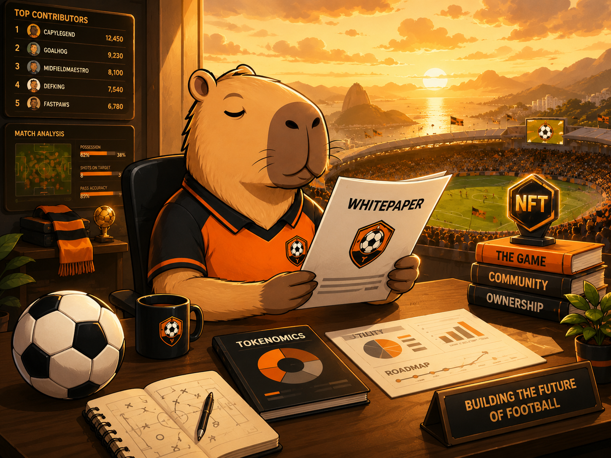
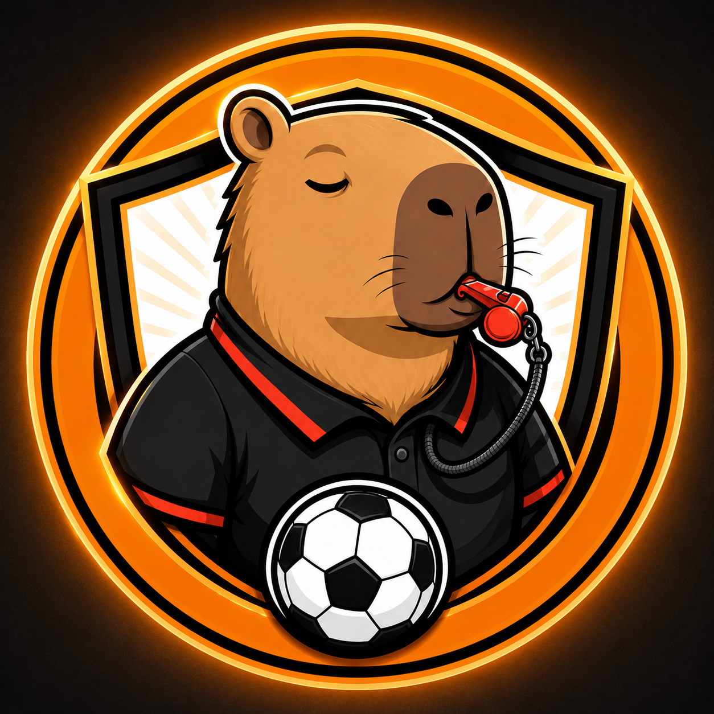
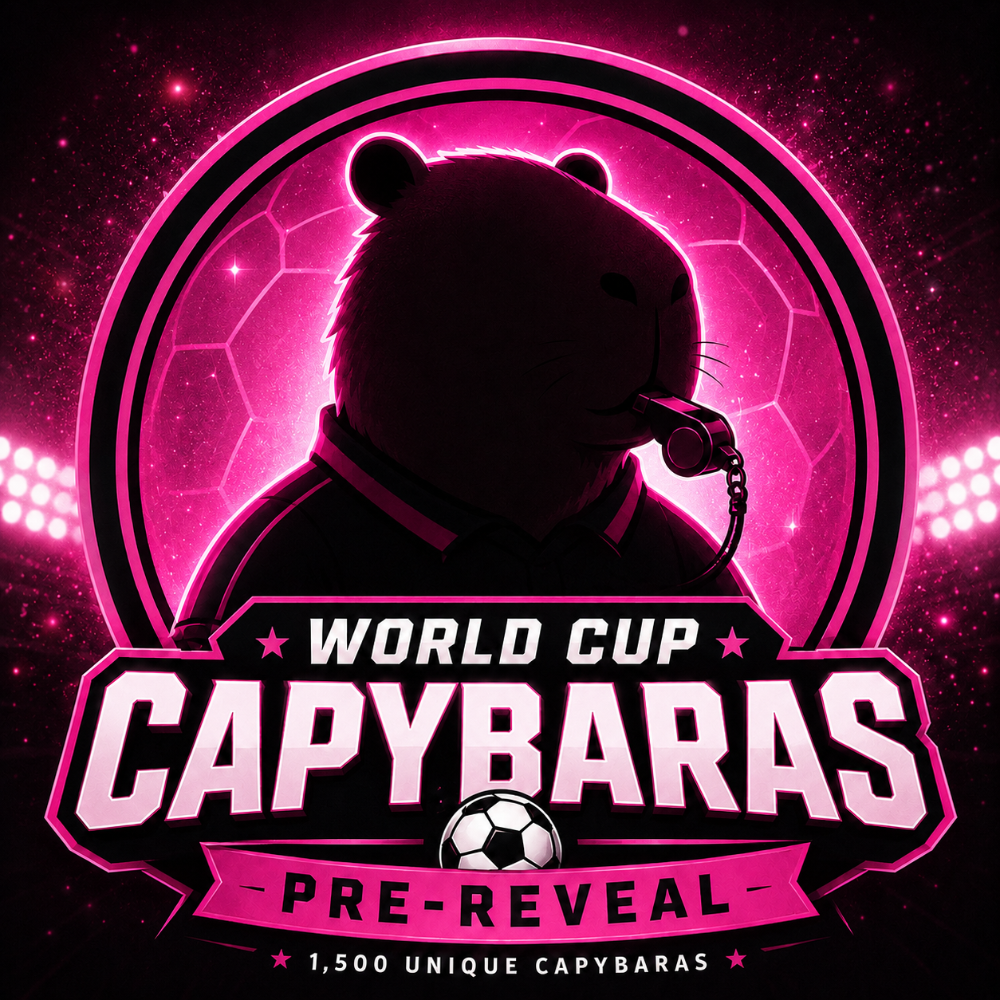
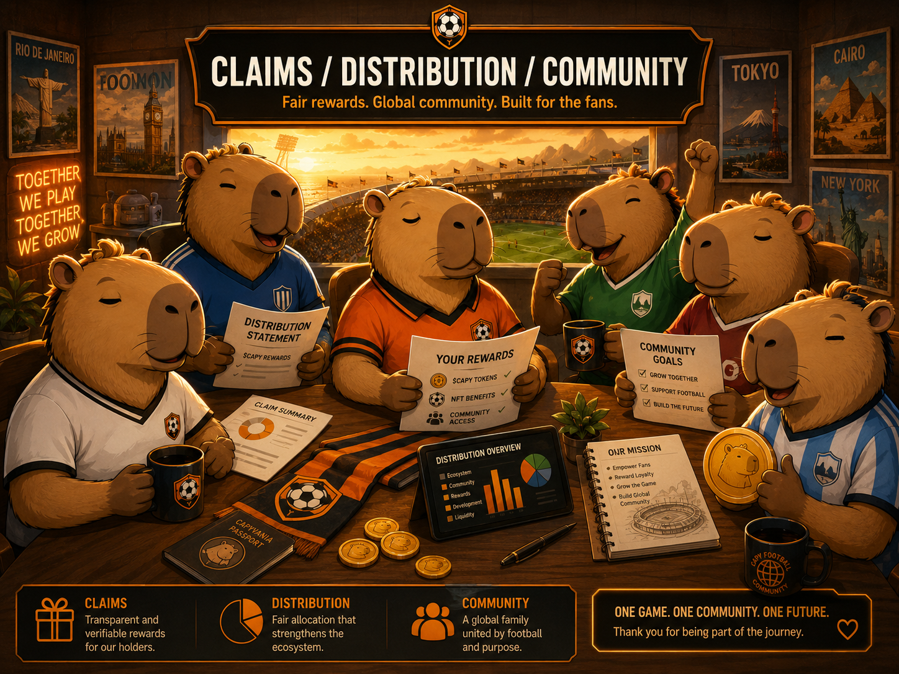
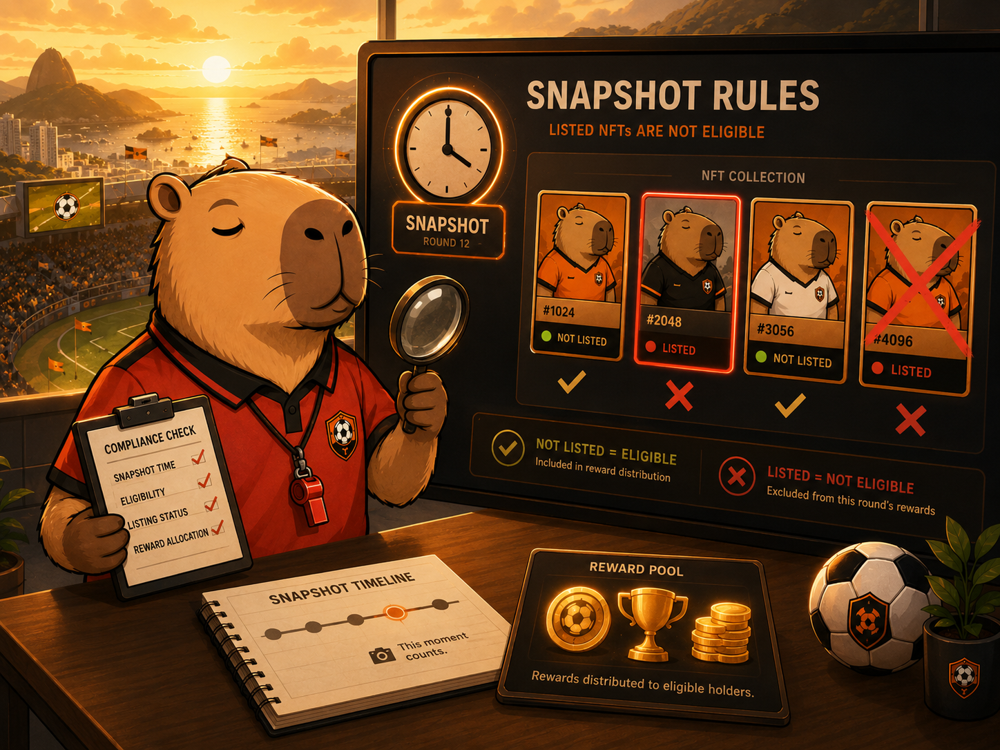
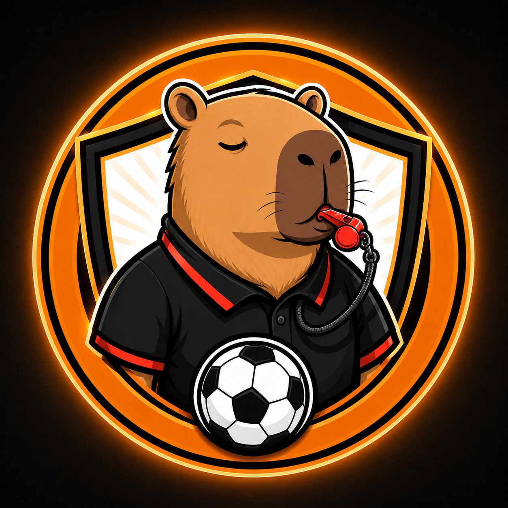

# World Cup Capybaras Whitepaper v0.9 - Qualification Slots/Base Update

**Project name:** World Cup Capybaras  
**Game direction:** Knockouts Capybaras / qualification-slot game  
**Version:** v0.9  
**Status:** Draft for publication  
**Chain:** Base  
**Supply:** 1,500 NFTs  
**Mint date:** TBD  
**Mint price:** TBD  
**Mint platform:** TBD

---

## 1. Project Summary

World Cup Capybaras is a football-inspired NFT collection built around a tournament-style community game.

The public project name remains **World Cup Capybaras**. The updated game direction is **Knockouts Capybaras**, now using a **Qualification Slot Model**.

Instead of distributing NFTs directly across all 48 national teams before the tournament, the collection represents the **32 qualification slots** that enter the knockout stage:

- 12 group winner slots;
- 12 group runner-up slots; and
- 8 best third-place qualification slots.

This keeps the game tied to the official tournament structure while making the collection easier to understand: each NFT is assigned to a qualification slot such as **A1**, **A2**, or **3Q1**. After the group stage, that slot resolves to the real team that earned it.

The collection is planned for **Base**. Mint date, mint price, and mint platform are currently **TBD**.

---

## 2. Launch Configuration

| Item | Current Definition |
| --- | --- |
| Public project name | World Cup Capybaras |
| Game direction | Knockouts Capybaras / qualification-slot game |
| Chain | Base |
| Total supply | 1,500 NFTs |
| Mint date | TBD |
| Mint price | TBD |
| Mint platform | TBD |
| Reveal timing | TBD; after mint closes and before gameplay starts |
| Active supply | NFTs minted before the official cutoff |
| Unsold NFTs | Do not participate in rewards |

The project will not treat unsold NFTs as eligible game participants. Only NFTs that are part of the active minted supply can participate in tournament reward logic.

---

## 3. Qualification Slot Model

The 2026 tournament structure used as game context has **48 teams** split into **12 groups**.

The knockout field has **32 teams**:

- the top 2 teams from each of the 12 groups qualify directly;
- the 8 best third-place teams overall also qualify.

World Cup Capybaras represents these 32 knockout qualification slots.

### 3.1 Slot ID System

Group winner slots:

| Slot format | Meaning |
| --- | --- |
| A1 | Winner of Group A |
| B1 | Winner of Group B |
| ... | ... |
| L1 | Winner of Group L |

Group runner-up slots:

| Slot format | Meaning |
| --- | --- |
| A2 | Runner-up of Group A |
| B2 | Runner-up of Group B |
| ... | ... |
| L2 | Runner-up of Group L |

Best third-place slots:

| Slot format | Meaning |
| --- | --- |
| 3Q1 | Best third-place qualifier overall |
| 3Q2 | Second-best third-place qualifier overall |
| ... | ... |
| 3Q8 | Eighth-best third-place qualifier overall |

Third-place slot order follows the official tournament ranking and tiebreaker order used to determine the 8 best third-place qualifiers.

---

## 4. Slot Supply Allocation

The collection has **1,500 NFTs** across **32 qualification slots**.

The supply is intentionally weighted by expected qualification strength:

- group winners have the most NFTs;
- group runners-up have fewer NFTs;
- best third-place qualifiers have the fewest NFTs.

| Slot type | Slot IDs | Slots | NFTs per slot | Total NFTs |
| --- | --- | ---: | ---: | ---: |
| Group winners | A1-L1 | 12 | 54 | 648 |
| Group runners-up | A2-L2 | 12 | 45 | 540 |
| Best third-place #1 | 3Q1 | 1 | 42 | 42 |
| Best third-place #2 | 3Q2 | 1 | 41 | 41 |
| Best third-place #3 | 3Q3 | 1 | 40 | 40 |
| Best third-place #4 | 3Q4 | 1 | 39 | 39 |
| Best third-place #5 | 3Q5 | 1 | 38 | 38 |
| Best third-place #6 | 3Q6 | 1 | 38 | 38 |
| Best third-place #7 | 3Q7 | 1 | 37 | 37 |
| Best third-place #8 | 3Q8 | 1 | 37 | 37 |
| **Total** |  | **32** |  | **1,500** |

This means a first-place group slot is more common than a second-place group slot, and a third-place qualifier slot is scarcer than both.

The previous closest-even 48-team allocation concept is now archived and should not be treated as the current rule.

---

## 5. Reveal, Slot Assignment, and Team Resolution

The collection will use a delayed reveal.

Before reveal, NFTs may display generic pre-reveal Capybara artwork.

After mint closes, the active supply will be confirmed and the reveal process will begin. Reveal timing is currently **TBD**, but reveal is intended to happen after mint closes and before gameplay starts.

At reveal, each NFT is expected to show:

- final Capybara artwork;
- assigned qualification slot;
- slot type;
- reward weight;
- Captain status, when applicable.

After the tournament group stage is complete, each slot resolves to the real team that earned that slot.

Example:

- **A1** resolves to the winner of Group A.
- **A2** resolves to the runner-up of Group A.
- **3Q1** resolves to the best third-place qualifier overall.

Once a slot is assigned to an NFT, the slot assignment is final. Once official group-stage results are verified, the resolved team for that slot is final for game purposes.

---

## 6. Captain NFTs

Each qualification slot will include **1 Captain NFT**.

There are expected to be **32 Captain NFTs total**, one for each qualification slot.

Captain NFTs are special slot NFTs with a reward weight of **2 reward shares** when eligible.

Reward share weighting:

| NFT type | Eligible reward share weight |
| --- | ---: |
| Standard eligible NFT | 1 share |
| Eligible Captain NFT | 2 shares |

Captains do not bypass any game rule, snapshot rule, listing rule, wallet-holding rule, or eligibility rule. A Captain NFT must satisfy the same eligibility requirements as any other NFT to receive rewards.

If a Captain NFT is not eligible for a matchday or round, it receives no reward for that event.

---

## 7. Reward Share Calculation

When a reward is distributed for an eligible knockout-stage event, the reward pool for that event is divided by total eligible reward shares.

Example:

If an eligible winning slot includes:

- 10 standard eligible NFTs
- 1 eligible Captain NFT

Then total reward shares are:

- 10 standard NFTs x 1 = 10 shares
- 1 Captain NFT x 2 = 2 shares
- **Total = 12 reward shares**

The Captain receives 2 shares. Each standard eligible NFT receives 1 share.

This system lets Captains receive double the reward share while keeping eligibility rules consistent across all NFTs.

---

## 8. Metadata Traits

Final metadata may include, but is not limited to:

- Qualification Slot
- Slot Type
- Slot Supply Tier
- Resolved Team, after group-stage results are verified
- Captain status
- Reward weight
- Game format
- Artwork traits

Expected game-specific traits:

| Trait | Example |
| --- | --- |
| Qualification Slot | A1 |
| Slot Type | Group Winner |
| Slot Supply Tier | Winner slot / 54 NFTs |
| Resolved Team | Winner of Group A, once known |
| Captain | Yes / No |
| Reward Weight | 1 or 2 |
| Game Format | Knockouts Capybaras |
| Chain | Base |

The project may adjust non-game artistic traits before final metadata publication. Slot assignment, Captain status, and reward weight must be handled consistently with the published rules.

---

## 9. Matchday Snapshots and Listing Eligibility

For each active reward event, the project may take two official snapshots:

1. **Pre-event snapshot**
2. **Post-event snapshot**

After the post-event snapshot, the project will calculate preliminary eligible NFTs based on:

- the NFT being held by the same wallet in both snapshots;
- the NFT's qualification slot resolving to, qualifying for, participating in, or advancing through the active knockout-stage reward event, depending on the published event rules;
- the NFT being part of the active minted supply.

The project will then verify whether any preliminary eligible NFT was listed for sale at any point during the event window.

If an NFT was listed for sale at any time between the pre-event snapshot and the post-event snapshot, that NFT is not eligible to receive that event's reward.

The event window begins at the official pre-event snapshot and ends at the official post-event snapshot.

Final event eligibility is confirmed only after listing verification is completed.

---

## 10. Reward Eligibility

An NFT is not automatically eligible for a reward simply because its resolved team performs well.

To be eligible for a knockout-stage event or round reward, an NFT must satisfy the active published criteria, including:

- being part of the active minted supply;
- being held by the same wallet in the pre-event and post-event snapshots;
- having a qualification slot that resolves to a team that qualifies under that event's knockout-stage result rules;
- not being listed for sale at any time during the event window;
- satisfying any additional published eligibility rule for that event.

Captain NFTs follow the same eligibility rules. The only difference is reward-share weight: an eligible Captain counts as 2 reward shares instead of 1.

---

## 11. Listing Rule

NFTs listed for sale during an active reward event window are not eligible for that event's reward.

This rule is intended to discourage short-term listing behavior during active gameplay windows and protect the game logic from abuse.

The listing window begins at the official pre-event snapshot and ends at the official post-event snapshot.

A listed NFT may still participate in future events if it satisfies the future event's eligibility rules.

---

## 12. Reward Pool Notes

Reward pool details, reward funding, payout mechanics, payout timing, and operational procedures may be published separately before the game starts.

The project may use manual or automated verification workflows to calculate eligibility. Final reward eligibility is confirmed only after the project completes snapshot review, wallet review, slot resolution review, team-result review, and listing verification.

No reward is guaranteed unless all published eligibility requirements are satisfied and the project confirms final eligibility.

---

## 13. Community and Discord

The Discord server is the main community coordination space for:

- official announcements;
- rules and security updates;
- mint information;
- team and slot discussions;
- raffle and collab information;
- reward and knockout-stage updates.

Community team roles do not change NFT metadata, qualification slot assignment, resolved team, reward eligibility, or reward share weight.

Members should only trust links posted in official channels. The team will never ask for seed phrases, private keys, wallet passwords, or secret recovery phrases.

---

## 14. Safety and Anti-Scam Rules

Users should follow these safety rules:

- Never share a seed phrase or private key.
- Never trust unsolicited DMs claiming to be support.
- Only use links from official project channels.
- Verify mint information before interacting with any contract or page.
- Treat fake mint links, fake support accounts, and fake airdrops as scams.

The project may update safety rules as needed before mint and before gameplay starts.

---

## 15. Non-Affiliation Disclaimer

World Cup Capybaras is not affiliated with FIFA, the FIFA World Cup, national teams, federations, leagues, sponsors, players, or official tournament organizers.

All football, country, and tournament-inspired references are used as part of an independent community collectibles game concept.

---

## 16. Risk Disclaimer

NFTs involve risk. Participation in the project should not be considered financial advice, investment advice, or a guarantee of profit.

Mint details, marketplace behavior, network fees, reward mechanics, eligibility verification, metadata updates, and project operations may involve technical and operational risks.

Users are responsible for their own wallet security and transaction decisions.

---

## 17. Version History

| Version | Summary |
| --- | --- |
| v0.6 | Earlier Ethereum/Highlight-oriented draft |
| v0.7 | Mint/reveal and snapshot/listing clarification draft |
| v0.8 | Knockouts/Base update with closest-even 48-team allocation concept |
| v0.9 | Qualification Slot Model: 32 knockout qualification slots, A1-L1/A2-L2/3Q1-3Q8 IDs, weighted slot supply, Base/TBD launch details |

---

## 18. Current Status

This v0.9 whitepaper is the current project direction draft.

Before final launch, the project should confirm:

- mint platform;
- mint date;
- mint price;
- final reveal process;
- final slot metadata process;
- final slot resolution process after group-stage results;
- final snapshot timing;
- final knockout reward event schedule;
- final reward pool mechanics;
- final contract and metadata deployment details.
